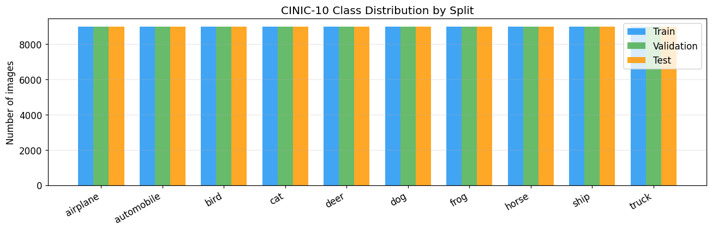
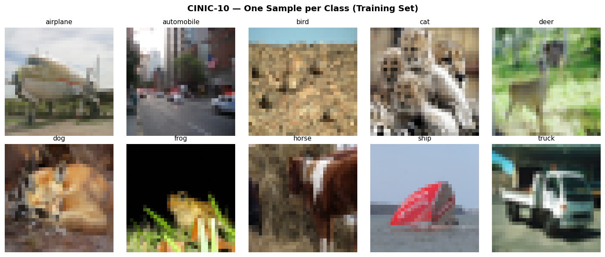

# **Project I: Image Classification with Convolutional Neural Networks**

###### **Dataset:** CINIC-10

###### **Course:** Deep Learning, Warsaw University of Technology, 2026

###### **Author:** Ljubomir Kolev

###### **Date:** 30.03.2026

---

## Abstract

We investigate image classification on CINIC-10 (270,000 images, 10 classes, mixed CIFAR-10 and ImageNet sources) using convolutional neural networks. We compare four architectures - VGG-style, ResNet with residual connections, a compact EfficientCNN, and a regularisation-configurable CNN - and find that ResNet Deep wins by a wide margin (79.8% validation accuracy, 13+ pp ahead of second place). Hyperparameter sweeps show that learning rate and dropout matter most, with dropout $\geq$ 0.5 killing training entirely. Data augmentation turns out to be epoch-dependent: heavier pipelines hurt at 5 epochs but help at 15+. For few-shot learning, Prototypical Networks reach 26.6% (1-shot) and 30.4% (5-shot) on 10-way tasks, far above the naive train-from-scratch baseline which stays at random chance. Soft voting over 3 independently trained models beats any single member. All experiments ran on Apple M1 Max (MPS backend) with platform-specific optimisations documented in Section 3.3.

---

## Table of Contents

1. [Introduction and problem description](#1-introduction-and-problem-description)
2. [Theoretical background and literature review](#2-theoretical-background-and-literature-review)
3. [Experimental setup](#3-experimental-setup)
4. [Experiments and results](#4-experiments-and-results)
   - 4.1 [Architecture comparison](#41-architecture-comparison)
   - 4.2 [Hyperparameter analysis](#42-hyperparameter-analysis)
   - 4.3 [Data augmentation study](#43-data-augmentation-study)
   - 4.4 [Statistical significance](#44-statistical-significance)
   - 4.5 [Few-shot learning](#45-few-shot-learning)
   - 4.6 [Ensemble methods](#46-ensemble-methods)
   - 4.7 [Final test-set evaluation](#47-final-test-set-evaluation)
5. [Conclusions](#5-conclusions)
6. [Reproducibility](#6-reproducibility)
7. [References](#7-references)

---

## 1. Introduction and problem description

Image classification is one of the basic problems in computer vision: given a fixed-size image, assign it to one of a set of categories. CNNs have dominated this space since AlexNet in 2012 [1], and later architectures like VGGNet [2], ResNet [3], and EfficientNet [4] have steadily improved accuracy on standard benchmarks.

### 1.1 The CINIC-10 dataset

CINIC-10 [5] was built as a harder version of CIFAR-10. It has the same 10 classes (airplane, automobile, bird, cat, deer, dog, frog, horse, ship, truck) but with 270,000 images total, because downsampled ImageNet samples were added on top of the original CIFAR-10 ones. The split is even: 90,000 images each for training, validation, and test. All images are 32x32 RGB.

Because the images come from two different sources (CIFAR-10 and ImageNet), there is a domain shift that makes generalisation harder than on CIFAR-10 alone. CIFAR-10 images tend to be centred, low-resolution photos, while the ImageNet ones are downscaled crops with different viewpoints and backgrounds. This mix of sources means models have to deal with more intra-class variation than on plain CIFAR-10.


*Figure 1: Class distribution across all three CINIC-10 splits. Each class has exactly 9,000 images per split, giving a perfectly balanced dataset.*


*Figure 2: Representative samples from each of the 10 CINIC-10 classes.*

### 1.2 Research questions

We set out to answer five questions:

1. Which CNN architecture works best on CINIC-10? We compare four designs, from a plain VGG-style stack to a ResNet with skip connections.
2. How much do hyperparameters matter? We vary learning rate, batch size, optimizer, dropout, and weight decay one at a time.
3. Does data augmentation help, and when? We test seven augmentation pipelines including Cutout and AutoAugment.
4. Can we classify with very few labelled examples? We try Prototypical Networks and compare them to a naive train-from-scratch approach.
5. Does combining multiple models help? We use hard and soft voting over independently trained models.

---

## 2. Theoretical background and literature review

### 2.1 Convolutional neural networks

A CNN processes an image through a stack of learnable filters. The basic operation is 2D convolution: a kernel $K$ of size $k \times k$ slides over the input feature map $X$ to produce output $Y$:

$$
Y(i, j) = \sum_{m=0}^{k-1} \sum_{n=0}^{k-1} K(m, n) \cdot X(i + m, j + n) + b
$$
where $b$ is a learnable bias term. Each filter learns to detect a specific local pattern (edges, textures, shapes), and stacking multiple convolutional layers lets the network build up hierarchically from low-level features to high-level semantic concepts [1].

In practice, modern CNNs interleave convolutional layers with nonlinearities (typically ReLU: $\text{ReLU}(x) = \max(0, x)$), spatial downsampling via max-pooling, and normalisation layers.

### 2.2 Batch normalisation

Batch normalisation (BN) [6] normalises the activations within each mini-batch to stabilise training. For a mini-batch $\mathcal{B} = \{x_1, \ldots, x_m\}$, BN computes:

$$
\hat{x}_i = \frac{x_i - \mu_{\mathcal{B}}}{\sqrt{\sigma_{\mathcal{B}}^2 + \epsilon}}
$$

$$
y_i = \gamma \hat{x}_i + \beta
$$

where $\mu_{\mathcal{B}}$ and $\sigma_{\mathcal{B}}^2$ are the mini-batch mean and variance, $\epsilon$ is a small constant for numerical stability, and $\gamma$, $\beta$ are learnable affine parameters. BN reduces sensitivity to weight initialisation and learning rate, enabling faster and more stable training. All four of our architectures use BN after every convolutional layer.

### 2.3 Residual connections

He et al. [3] introduced residual connections (skip connections) to address the degradation problem in deep networks: as depth increases beyond a certain point, training accuracy starts to decrease - not because of overfitting, but because the optimiser struggles to learn identity mappings through many nonlinear layers. A residual block reformulates the learning objective as:

$$
\mathbf{y} = \mathcal{F}(\mathbf{x}, \{W_i\}) + \mathbf{x}
$$
where $\mathcal{F}(\mathbf{x}, \{W_i\})$ is the residual function (typically two 3x3 conv layers with BN and ReLU) and $\mathbf{x}$ is the identity shortcut. The network only needs to learn the deviation from identity, which is easier to optimise. When the input and output dimensions differ (e.g., due to stride-2 downsampling), a 1x1 convolution projects the shortcut to matching dimensions:

$$
\mathbf{y} = \mathcal{F}(\mathbf{x}, \{W_i\}) + W_s \mathbf{x}
$$
Our ResNet Deep model uses this design with 9 residual blocks across 3 stages (64, 128, 256 channels), totalling 18 convolutional layers plus a stem convolution.

### 2.4 Loss function and label smoothing

The standard training objective for multi-class classification is the categorical cross-entropy loss:

$$
\mathcal{L}_{CE} = -\sum_{c=1}^{C} y_c \log(\hat{y}_c)
$$
where $y_c$ is 1 for the correct class and 0 otherwise, and $\hat{y}_c$ is the predicted probability for class $c$ (output of softmax). Minimising this loss pushes the network to assign high probability to the correct class.

Label smoothing [7] replaces hard one-hot targets with softened versions:

$$
y_c^{LS} = \begin{cases} 1 - \alpha + \alpha / C & \text{if } c = \text{true class} \\ \alpha / C & \text{otherwise} \end{cases}
$$
where $\alpha$ is the smoothing parameter (we use $\alpha = 0.1$). This prevents the model from becoming overconfident on training examples and has been shown to improve generalisation, especially on noisy or ambiguous datasets [7].

### 2.5 Optimisation

SGD with momentum updates parameters $\theta$ using:

$$
v_t = \mu \cdot v_{t-1} + \nabla_\theta \mathcal{L}(\theta_t)
$$

$$
\theta_{t+1} = \theta_t - \eta \cdot v_t
$$

where $\eta$ is the learning rate and $\mu$ is the momentum coefficient (we use $\mu = 0.9$). Momentum accumulates past gradients, helping the optimiser move through narrow valleys in the loss landscape and dampening oscillations.

Adam [8] adapts per-parameter learning rates using running estimates of first and second gradient moments. It generally converges faster than SGD in the early stages of training but may generalise worse on some tasks [9].

Instead of keeping the learning rate constant or manually decaying it, we use cosine annealing [10]:

$$
\eta_t = \eta_{min} + \frac{1}{2}(\eta_{max} - \eta_{min})\left(1 + \cos\left(\frac{t \pi}{T}\right)\right)
$$
where $T$ is the total number of epochs, $\eta_{max}$ is the initial learning rate, and $\eta_{min}$ is the minimum (typically 0). The learning rate starts high and smoothly decays following a cosine curve, which avoids the need for manual step schedules and helps the model converge to flatter minima.

### 2.6 Regularisation

Dropout [11] randomly sets a fraction $p$ of activations to zero during training:

$$
\tilde{h}_i = \begin{cases} 0 & \text{with probability } p \\ h_i / (1 - p) & \text{with probability } 1 - p \end{cases}
$$
The $(1-p)$ scaling ensures that expected activation magnitudes remain the same between training and inference. Dropout prevents co-adaptation of neurons and acts as an implicit ensemble over exponentially many sub-networks.

Weight decay (L2 regularisation) adds a penalty on the squared magnitude of the weights to the loss function:

$$
\mathcal{L}_{total} = \mathcal{L}_{CE} + \lambda \sum_i \|w_i\|^2
$$
where $\lambda$ is the weight decay coefficient. This discourages large weights, which tend to produce overfitting. With SGD, weight decay is equivalent to L2 regularisation; with Adam, they differ slightly [12], but the PyTorch `weight_decay` parameter implements the decoupled version.

### 2.7 Data augmentation

Data augmentation artificially expands the training set by applying random transformations to images. Common augmentation techniques include:

- Random horizontal flip: mirrors the image left-right with 50% probability
- Random rotation: rotates by a random angle within a specified range
- Random affine transformations: applies combinations of translation, scaling, and shearing
- Color jitter: randomly adjusts brightness, contrast, saturation, and hue

More advanced augmentation techniques have been proposed to improve generalisation:

Cutout [13] randomly masks out a square region of the input image during training. For an image of size $H \times W$, a patch of size $s \times s$ centered at a random position is zeroed out. This forces the network to attend to multiple parts of the image rather than relying on a single discriminative region.

AutoAugment [14] uses reinforcement learning to search for the best augmentation policy for a given dataset. The CIFAR-10 policy (which we use for CINIC-10 given the similar image size and class structure) consists of 25 sub-policies, each applying two transforms chosen from a pool of 14 operations with learned probability and magnitude. We specifically chose `AutoAugmentPolicy.CIFAR10` over `TrivialAugmentWide` because the latter applies extreme magnitudes (e.g., rotation up to 135 degrees, translation up to 32 pixels) that completely destroy content at 32x32 resolution.

Mixup [15] creates virtual training examples by taking convex combinations of pairs of images and their labels:

$$
\tilde{x} = \lambda x_i + (1 - \lambda) x_j, \qquad \tilde{y} = \lambda y_i + (1 - \lambda) y_j
$$
where $\lambda \sim \text{Beta}(\alpha, \alpha)$. This encourages the model to behave linearly between training examples, which acts as a form of regularisation.

### 2.8 Few-shot learning and Prototypical Networks

Few-shot learning addresses the problem of classifying images when only a handful of labelled examples are available per class. Standard supervised training breaks down in this regime because randomly initialised neural networks need thousands of examples to learn useful features.

Prototypical Networks [16] tackle this through episodic meta-training. The key idea is to learn an embedding function $f_\phi$ that maps images into a metric space where samples from the same class cluster together. Classification is then performed by computing distances to class prototypes.

Given a support set $S_k = \{(x_1, y_1), \ldots, (x_K, y_K)\}$ for class $k$, the prototype is the mean of the embedded support points:

$$
\mathbf{c}_k = \frac{1}{|S_k|} \sum_{(x_i, y_i) \in S_k} f_\phi(x_i)
$$
A query image $x$ is classified by finding the nearest prototype in Euclidean distance:

$$
p(y = k \mid x) = \frac{\exp(-\|f_\phi(x) - \mathbf{c}_k\|^2)}{\sum_{k'} \exp(-\|f_\phi(x) - \mathbf{c}_{k'}\|^2)}
$$
The network is trained by minimising cross-entropy over these distance-based probabilities across many randomly sampled episodes (N-way K-shot tasks). At test time, prototypes are simply computed from new support images - no fine-tuning needed. This is why ProtoNets can work with very few examples while a standard CNN trained from scratch cannot.

### 2.9 Ensemble methods

Ensemble methods combine predictions from multiple independently trained models to reduce variance and improve robustness. Two common strategies are:

Hard voting: each model casts a vote for its predicted class, and the ensemble prediction is the majority:

$$
\hat{y} = \text{mode}(\hat{y}_1, \hat{y}_2, \ldots, \hat{y}_M)
$$
Soft voting: the ensemble averages the softmax probability vectors from all members and then takes the argmax:

$$
\hat{y} = \arg\max_c \frac{1}{M} \sum_{m=1}^{M} p_m(c \mid x)
$$
Soft voting generally outperforms hard voting because it preserves confidence information - a model that assigns 90% probability to the correct class contributes more than one at 40%, even though both would vote the same way under hard voting [17].

---

## 3. Experimental setup

### 3.1 Hardware and software

All experiments were run on an **Apple M1 Max MacBook Pro** (24-core GPU, 32 GB unified memory) using the **MPS** (Metal Performance Shaders) backend for PyTorch. The software stack consists of Python 3.13, PyTorch 2 with torchvision, scikit-learn, pandas, matplotlib, seaborn, and tqdm.

### 3.2 Training pipeline

Our main training pipeline uses the following configuration for the architecture comparison and final evaluation:

- **Optimiser:** SGD with momentum 0.9 and weight decay $5 \times 10^{-4}$
- **Learning rate schedule:** Cosine annealing from initial LR to 0 over the training horizon
- **Label smoothing:** $\alpha = 0.1$
- **Data augmentation:** RandomCrop(32, padding=4) + RandomHorizontalFlip + AutoAugment(CIFAR10)
- **Input normalisation:** channel-wise normalisation using CINIC-10 statistics:
  - Mean: $(0.4789, 0.4723, 0.4305)$
  - Std: $(0.2421, 0.2383, 0.2587)$
- **Early stopping:** patience of 5 epochs based on validation accuracy
- **Mixed precision:** float16 via `torch.autocast` on MPS/CUDA (disabled on CPU)

The core training loop with mixed-precision support:

```python
_dev_type = device.type if hasattr(device, "type") else "cpu"
_use_amp = _dev_type in ("cuda", "mps")

for images, labels in train_loader:
    images, labels = images.to(device), labels.to(device)
    optimizer.zero_grad()
    with torch.autocast(device_type=_dev_type, dtype=torch.float16,
                        enabled=_use_amp):
        outputs = model(images)
        loss = criterion(outputs, labels)
    loss.backward()
    optimizer.step()
```

### 3.3 Hardware-specific optimisations for Apple Silicon

Running on MPS rather than CUDA required several platform-specific adjustments.

Data loading: we use `num_workers=4` with `persistent_workers=True`. On macOS, Python multiprocessing uses `spawn` (not `fork`), so without persistent workers each epoch would re-spawn all worker processes, adding several seconds of overhead. `pin_memory` is kept at `False` because MPS uses unified memory (CPU and GPU share the same physical RAM), so page-locked memory offers no benefit.

Batch size: CINIC-10 images are 32x32, so after three pooling stages the spatial dimensions shrink to 4x4. At this scale, each MPS kernel call does very little work relative to the fixed per-call launch overhead. Increasing batch size from 128 to 512 reduced kernel launches per epoch from ~704 to ~176, roughly doubling throughput. However, larger models need smaller batches: ResNet Deep at batch_size=512 triggered MPS memory pressure and slowed to ~2 batch/s. The root cause is that ResNet Deep's first stage has no spatial downsampling (the feature maps stay at 32×32 throughout), so each of its 3 residual blocks must store 512 × 64 × 32 × 32 activation tensors for the skip connection — roughly 4× more activation memory than a VGG-style model at the same batch size. We therefore used per-model batch size configuration:

| Model | Parameters | Batch Size | LR (SGD) | Workers |
|-------|-----------|-----------|----------|---------|
| EfficientCNN | ~0.5M | 2048 | 0.08 | 8 |
| CNNWithRegularization | ~0.5M | 2048 | 0.08 | 8 |
| VGG Baseline | ~2M | 512 | 0.04 | 4 |
| ResNet Deep | 4.3M | 256 | 0.02 | 4 |

Learning rates are scaled using the **linear scaling rule** [18]: when batch size doubles, LR also doubles (reference: lr=0.01 at batch_size=128). For the smallest models, we used half the full linear scale as a safety margin since we did not implement a warmup schedule.

Mixed precision: `torch.autocast` with `dtype=torch.float16` provides a 10-20% speedup per epoch on MPS. BatchNorm layers automatically stay in float32 inside the autocast context (handled internally by PyTorch), so numerical stability is preserved.

HP sweep subsetting: to reduce sweep wall-clock time by approximately 13x, we ran HP sweeps on 25% of the training data for 3 epochs. This preserves relative rankings between configurations while being much faster than full-data sweeps. The sweep results in Section 4.2 use this reduced setup; the 5-epoch results in the CSVs come from an earlier run with slightly different defaults.

### 3.4 Model architectures

We implemented four CNN architectures, all accepting 32x32 RGB input and outputting 10-class logits:

**VGG Baseline** - a VGG-style network [2] with 8 convolutional layers arranged in three blocks of (3, 3, 2) convolutions with channel progression 32 $\to$ 64 $\to$ 128. Each conv uses 3x3 kernels with BN and ReLU. Blocks are separated by MaxPool2d(2) and Dropout2d(0.25). The classifier head is Flatten(2048) $\to$ Linear(512) $\to$ BN $\to$ ReLU $\to$ Dropout(0.5) $\to$ Linear(10).

**ResNet Deep** - a CIFAR-style ResNet [3] with a stem convolution (3 $\to$ 64 channels) followed by three stages of 3 residual blocks each, with channel widths 64, 128, 256 and stride-2 downsampling between stages. Uses global average pooling and a single linear layer (256 $\to$ 10) as the classifier, with Dropout(0.3) before it. Total: 18 convolutional layers, 4.3M parameters.

**EfficientCNN** - a compact architecture with the same three-block structure as VGG Baseline but using only 6 convolutional layers and a smaller classifier head (2048 $\to$ 256 $\to$ 10). Lower dropout rates (0.2/0.3) and fewer parameters (~0.5M) make it faster to train and well-suited for ensemble use.

**CNNWithRegularization** - same architecture as VGG Baseline but with a configurable dropout rate. Used as the model for the regularisation hyperparameter grid search (Section 4.2.4).

---

## 4. Experiments and results

### 4.1 Architecture comparison

All four architectures were trained for 15 epochs under identical conditions: SGD with cosine-annealing LR, AutoAugment(CIFAR10) augmentation, and per-model batch sizes scaled by the linear scaling rule.

| Architecture | Best Val. Accuracy | Final Val. Accuracy | Final Val. Loss | Epochs |
|---|---|---|---|---|
| VGG Baseline | 61.8% | 61.8% | 1.335 | 15 |
| ResNet Deep | **79.8%** | **79.8%** | 0.958 | 15 |
| EfficientCNN | 62.4% | 62.4% | 1.322 | 15 |
| CNNWithRegularization | 66.8% | 66.8% | 1.236 | 15 |

*Table 1: Architecture comparison on CINIC-10 (15 epochs, strong augmentation pipeline).*


*Figure 3: Validation accuracy comparison across the four architectures.*


*Figure 4: Training and validation learning curves for all architectures over 15 epochs.*

ResNet Deep is 13 pp ahead of the second-best model (CNNWithRegularization). The reason comes down to depth: ResNet Deep has 18 convolutional layers vs. 6-8 in the others, and the residual connections keep gradients flowing through all of them. Without skip connections, stacking more VGG-style layers does not help - it actually makes things worse because the optimiser cannot learn useful mappings through that many nonlinear layers. This is exactly the degradation problem described in He et al. [3]. The plain architectures (VGG, EfficientCNN) sit around 62% and seem unable to go higher with this depth.

An interesting detail: CNNWithRegularization (66.8%) beats VGG Baseline (61.8%) despite having an almost identical structure. The difference is just the dropout setting - CNNWithRegularization uses a configurable (lighter) dropout, while VGG Baseline has a fixed Dropout(0.5) in the classifier head. This is a first sign that heavy dropout hurts at this model scale, something we dig into further in Section 4.2.4.

### 4.2 Hyperparameter analysis

For the hyperparameter sweeps, we used **VGG Baseline** trained for **5 epochs** on the full training set, varying one parameter at a time. We chose VGG Baseline rather than ResNet Deep for two reasons: it is much cheaper to train (512-batch at ~2M params vs. 256-batch at 4.3M), which matters when you are running dozens of configurations, and its moderate accuracy leaves room for hyperparameters to make a visible difference. Trends we find here (e.g. "dropout=0.5 kills training") should generalise to other architectures of similar capacity, though optimal values will shift when depth or width changes. The sweeps cover both training-process parameters (learning rate, batch size, optimizer) and regularisation parameters (dropout, weight decay).

One thing to keep in mind when reading these results: the sweeps use **Adam** as the default optimiser (not the SGD + cosine annealing from our main pipeline in Section 3.2). We wanted to match the common baseline people would reach for when doing quick experiments. The absolute accuracy numbers are therefore not directly comparable to Section 4.1 (which uses the full SGD pipeline with AutoAugment), but the relative rankings between configurations still hold.

#### 4.2.1 Learning rate

| Learning Rate | Train Acc. | Val. Acc. | Train Loss | Val. Loss |
|---|---|---|---|---|
| 0.0001 | 57.0% | 60.4% | 1.194 | 1.099 |
| **0.001** | **59.7%** | **63.5%** | **1.122** | **1.010** |
| 0.01 | 51.8% | 58.6% | 1.338 | 1.143 |
| 0.1 | 10.0% | 10.0% | 2.315 | 2.314 |

*Table 2: Learning rate sweep (Adam optimiser, 5 epochs). Bold indicates best configuration.*


*Figure 5: Validation accuracy and loss as a function of learning rate.*

The optimal learning rate with Adam is $\text{lr} = 0.001$, which is Adam's default. At $\text{lr} = 0.0001$ the model trains stably but converges too slowly to reach peak accuracy within 5 epochs - it trails by 3.1 percentage points but would likely close the gap with longer training. At $\text{lr} = 0.01$ the learning rate is already too aggressive, causing unstable updates and worse convergence. At $\text{lr} = 0.1$ the model fails to train entirely: loss stays at $\ln(10) \approx 2.30$ (random guess) and accuracy is 10% (1 in 10 classes), which means the gradient steps are so large that they overshoot any useful minimum.

#### 4.2.2 Batch size

| Batch Size | Train Acc. | Val. Acc. | Train Loss | Val. Loss |
|---|---|---|---|---|
| 16 | 57.3% | 63.4% | 1.193 | 1.019 |
| 32 | 60.3% | 64.1% | 1.105 | 0.997 |
| **64** | **61.4%** | **65.4%** | **1.071** | **0.961** |

*Table 3: Batch size sweep (Adam, lr=0.001, 5 epochs).*


*Figure 6: Validation accuracy and loss as a function of batch size.*

Larger batches help in this range: batch_size=64 gets 65.4%, a +2.0 pp gain over batch_size=16. The gradient estimates are more stable with bigger batches, so the optimiser makes more reliable steps. Interestingly, the train/val gap also changes - it is 4.1 pp at batch=16 but 6.0 pp at batch=64, which suggests that smaller batches add noise that implicitly regularises training, even though it slows convergence.

#### 4.2.3 Optimiser

| Optimiser | Train Acc. | Val. Acc. | Train Loss | Val. Loss |
|---|---|---|---|---|
| **Adam** | **59.7%** | **64.0%** | **1.121** | **1.001** |
| SGD | 55.6% | 61.0% | 1.234 | 1.081 |
| RMSprop | 57.1% | 60.1% | 1.183 | 1.104 |

*Table 4: Optimiser comparison (lr=0.001, batch=32, 5 epochs).*


*Figure 7: Validation accuracy and loss by optimiser.*

Adam is 3.0 pp ahead of SGD and 3.9 pp ahead of RMSprop at 5 epochs. This makes sense - Adam adapts per-parameter learning rates based on gradient history, which gives it faster early convergence. But faster early convergence does not mean better final accuracy. Wilson et al. [9] showed that SGD with momentum often generalises better than adaptive methods when given enough training time. That is exactly what we found in our own experiments: Adam wins at 5 epochs, but our architecture comparison (Section 4.1, 15 epochs) and final evaluation (Section 4.7, 20-30 epochs) both use SGD + cosine annealing and reach substantially higher accuracy than anything we got with Adam in this sweep. Adam wins the sprint, SGD wins the marathon - and since our final models train for 15-30 epochs, we go with SGD for everything after these HP sweeps.

#### 4.2.4 Regularisation (dropout + weight decay)

We conducted a grid search over dropout rate $\in \{0.1, 0.2, 0.3, 0.5\}$ and weight decay $\in \{10^{-4}, 10^{-3}, 10^{-2}\}$ using CNNWithRegularization.

| Dropout | Weight Decay | Train Acc. | Val. Acc. |
|---|---|---|---|
| **0.1** | **$10^{-4}$** | **65.2%** | **67.2%** |
| 0.1 | $10^{-3}$ | 59.9% | 64.1% |
| 0.1 | $10^{-2}$ | 49.0% | 51.0% |
| 0.2 | $10^{-4}$ | 58.5% | 63.9% |
| 0.2 | $10^{-3}$ | 54.7% | 58.8% |
| 0.2 | $10^{-2}$ | 44.5% | 49.0% |
| 0.3 | $10^{-4}$ | 53.0% | 60.0% |
| 0.3 | $10^{-3}$ | 49.5% | 54.4% |
| 0.3 | $10^{-2}$ | 40.7% | 44.4% |
| 0.5 | any | ~9.8% | 10.0% |

*Table 5: Regularisation grid search. Dropout=0.5 collapses training regardless of weight decay.*


*Figure 8: Heatmap of validation accuracy across the dropout rate x weight decay grid.*

This was probably the most informative sweep we ran. The best configuration is dropout=0.1 with weight_decay=$10^{-4}$, at 67.2% validation accuracy - 3.7 pp above the baseline (dropout=0.25, no weight decay). Both parameters have a clear monotonic effect: cranking up either one hurts accuracy, and dropout has the larger impact of the two. The effects are mostly additive; there is no strong interaction between the two.

The dropout=0.5 rows are worth calling out. Regardless of weight decay, the model does not learn at all - accuracy is stuck at 10% (random chance) and loss stays at $\ln(10) \approx 2.30$. When half the activations are zeroed every forward pass, there is simply not enough signal left for a model this small (~0.5M parameters) to pick up on. It was a useful reminder that over-regularisation can be worse than no regularisation at all.

### 4.3 Data augmentation study

We evaluated seven augmentation pipelines on VGG Baseline (5 epochs, Adam lr=0.001, batch=32). We deliberately kept the same default HPs from Section 4.2 to isolate the effect of augmentation alone - if we changed the optimiser or LR at the same time, we could not tell whether accuracy moved because of the augmentation or the HP change. The trade-off is that 5 epochs with Adam is a short schedule, and as we will see, augmentation benefits mainly show up with longer training.

For reference, the best no-augmentation result from Section 4.2 is approximately 63.5% (the lr=0.001 learning rate sweep result, which uses only Resize + ToTensor).

#### 4.3.1 Visual comparison


*Figure 9: Visual comparison of standard augmentation techniques applied to the same input image.*


*Figure 10: Cutout augmentation: a random 8x8 region is zeroed out, forcing the model to use multiple image regions for classification.*

#### 4.3.2 Standard augmentations

| Augmentation | Train Acc. | Val. Acc. | Train Loss | Val. Loss |
|---|---|---|---|---|
| **Minimal** (flip only) | **59.5%** | **64.2%** | **1.126** | **0.993** |
| Crop + Resize | 55.4% | 61.9% | 1.237 | 1.043 |
| Standard (rot+flip+affine) | 51.3% | 56.5% | 1.341 | 1.194 |
| Colour Jitter | 46.7% | 54.0% | 1.455 | 1.255 |

*Table 6: Standard augmentation comparison (5 epochs).*

#### 4.3.3 Advanced augmentations

| Augmentation | Train Acc. | Val. Acc. | Train Loss | Val. Loss |
|---|---|---|---|---|
| **Mixup** | **52.9%** | **59.6%** | **1.298** | **1.116** |
| AutoAugment-like | 47.5% | 54.6% | 1.430 | 1.254 |
| Cutout | 55.3% | 53.7% | 1.233 | 1.294 |

*Table 7: Advanced augmentation comparison (5 epochs).*


*Figure 11: Validation accuracy for all augmentation pipelines compared against the no-augmentation baseline (dashed line).*

This was a bit counterintuitive at first: at 5 epochs, only the minimal pipeline (just a horizontal flip) improves over no augmentation at all (64.2% vs. ~63.5%). Everything else - rotation, affine transforms, Cutout, Mixup, AutoAugment-style - actually makes accuracy worse. Colour jitter is the worst offender at 54.0%.

But it makes sense once you think about training budget. Augmentation increases the effective diversity of the training data, and the model needs more epochs to learn the invariances these transforms are meant to teach. At 5 epochs the model has barely converged on the raw data; adding augmentation just makes the task harder with no time to benefit. In the architecture comparison (Section 4.1), where we train for 15 epochs with AutoAugment, the situation is completely different - augmentation clearly helps there.

Cutout stands out as a curious case. Training accuracy is reasonable (55.3%) but validation accuracy is lower (53.7%), so there is a small negative transfer. The 8x8 mask covers a good chunk of a 32x32 image, and 5 epochs is apparently not enough for the model to learn to deal with that.

This is why we still chose AutoAugment(CIFAR10) for the architecture comparison (Section 4.1, 15 epochs) and the final evaluation (Section 4.7, 20-30 epochs). The augmentation study here tells us that heavy augmentation is a bad idea on short schedules, not that it is a bad idea in general. With 15+ epochs, the model has time to learn from the harder augmented examples, and the regularisation effect pays off - as Section 4.1 already shows with ResNet Deep reaching 79.8% under AutoAugment.

### 4.4 Statistical significance

Single-run results are unreliable because random seed affects weight initialisation, data shuffling, and augmentation order. We re-trained two configurations 3 times each (15 epochs, different seeds) and report mean and standard deviation.

| Configuration | Seed | Best Val. Acc. |
|---|---|---|
| Baseline (dropout=0.25, wd=0) | 7934 | 69.4% |
| Baseline (dropout=0.25, wd=0) | 3998 | 68.2% |
| Baseline (dropout=0.25, wd=0) | 6523 | 68.4% |
| **Mean +/- Std** | | **68.6% +/- 0.65%** |
| Best Reg. (dropout=0.1, wd=1e-4) | 7934 | 67.9% |
| Best Reg. (dropout=0.1, wd=1e-4) | 3998 | 67.5% |
| Best Reg. (dropout=0.1, wd=1e-4) | 6523 | 67.5% |
| **Mean +/- Std** | | **67.6% +/- 0.25%** |

*Table 8: Multi-seed reproducibility test (15 epochs, 3 seeds per config).*


*Figure 12: Multi-seed comparison of Baseline vs. Best Regularisation configuration.*

The numbers tell a different story from the HP sweep. At 5 epochs (Section 4.2.4), dropout=0.1 with wd=$10^{-4}$ was 3.7 pp better than the baseline. But at 15 epochs the baseline actually pulls ahead: 68.6% vs. 67.6%. The "best reg" config has lower variance (0.25% vs. 0.65%), meaning it is more consistent but tops out at a lower accuracy.

Our best guess is that lower dropout (0.1) helps early on because the model retains more information per forward pass and learns faster. But with more epochs, that lighter regularisation allows overfitting that the default dropout=0.25 would have prevented. The takeaway for us was that HP sweep results at short schedules can be misleading - the "best" at 5 epochs is not necessarily the best at 15.

This influenced our final training setup. Rather than blindly copying the "winning" dropout=0.1 from Section 4.2.4, we kept each architecture's built-in dropout defaults (0.5 for VGG Baseline, 0.3 for ResNet Deep) for the longer runs in Sections 4.7 and 4.1, since we now know that moderate dropout pays off with enough training time. We did keep weight_decay=$5 \times 10^{-4}$ across the board, since that parameter showed a consistent benefit at both 5 and 15 epochs.

### 4.5 Few-shot learning

#### 4.5.1 Naive baseline: train from scratch

We trained FewShotCNN (a CNN with global average pooling) directly on K labelled examples per class and evaluated on the full validation set.

| Samples/Class | Train Acc. | Val. Acc. | Val. Loss |
|---|---|---|---|
| 1 | 30.0% | 10.0% | 2.305 |
| 5 | 18.0% | 10.0% | 2.305 |
| 10 | 27.0% | 10.0% | 2.304 |
| 50 | 29.2% | 10.1% | 2.684 |

*Table 9: Naive few-shot baseline. Validation accuracy stays at random chance (10%) for all K values.*

The model cannot generalise from this few examples. Even at K=50 (500 total images), the network memorises the training set to some extent (29.2% train accuracy) but none of that transfers to validation. The validation loss stays near $\ln(10) \approx 2.30$, which means the model is basically outputting a uniform distribution over all 10 classes. It has not picked up any useful features. This is not really surprising - a randomly initialised CNN needs thousands of images per class before it starts learning anything meaningful.

#### 4.5.2 Prototypical Networks: episodic meta-training

Prototypical Networks work differently. Rather than learning a full classifier from K examples, they learn an embedding function through episodic training - each training step simulates a few-shot task. At test time, class prototypes are just the mean embedding of K support images, and queries are classified by which prototype is closest.

Our ProtoNet uses a 4-block CNN encoder producing 64-dimensional L2-normalised embeddings. We initially ran it for 40 epochs but validation accuracy stopped improving after epoch 20, so 20 epochs became our standard. It was trained on 10-way episodes sampled from the training set and evaluated on 600 episodes from the validation set.

| K-shot | Mean Acc. | Std. | 95% CI |
|---|---|---|---|
| 1-shot | 26.6% | 5.2% | +/- 0.42% |
| 5-shot | 30.4% | 4.6% | +/- 0.37% |

*Table 10: Prototypical Network evaluation (10-way, 600 episodes).*


*Figure 13: Prototypical Networks vs. naive few-shot baseline. ProtoNets substantially outperform the naive approach at all K values.*

The 5-shot ProtoNet (30.4%) is well above the naive model's ~10%, even though the naive version uses 10x more labelled data per class. The difference is that the embedding function learns from the full training set and transfers that knowledge into a reusable distance metric, instead of trying to build features from scratch with a handful of images.

That said, 26-30% on 10-way classification is still not great in absolute terms. It is about 2.6-3x better than random guessing, but nowhere near the 80% we get with full supervised training. Part of the gap is inherent to the task difficulty - most ProtoNet benchmarks in the literature use 5-way classification, which is easier. A deeper or pre-trained embedding network would probably help too.

#### 4.5.3 Reduced dataset experiment

To bridge the gap between few-shot and full-data regimes, we trained VGG Baseline on subsets of 10%, 25%, 50%, and 100% of the training data.

| Training Fraction | Val. Accuracy | Samples |
|---|---|---|
| 10% | 41.8% | 9,000 |
| 25% | 48.1% | 22,500 |
| 50% | 54.8% | 45,000 |
| 100% | 59.9% | 90,000 |

*Table 11: Reduced dataset experiment.*


*Figure 14: Validation accuracy as a function of training set size.*


*Figure 15: Overview of few-shot learning results across all methods and data sizes.*

Accuracy scales roughly logarithmically with dataset size. Doubling the data gives diminishing returns: 10% $\to$ 25% gains +6.3 pp, 25% $\to$ 50% gains +6.7 pp, but 50% $\to$ 100% only +5.1 pp. With 10% of data (9,000 samples, ~900/class) we already get 41.8%, much better than the naive few-shot numbers (~10% at 50 samples/class) but still well below the full-data 59.9%. More data always helps on CINIC-10, just with decreasing marginal returns.

### 4.6 Ensemble methods

We trained 3 EfficientCNN models with different seeds and combined their predictions via hard and soft voting. We picked EfficientCNN rather than ResNet Deep for a practical reason: Section 4.1 showed that ResNet Deep is 4x slower to train per epoch (4.3M params at batch_size=256 vs. 0.5M at batch_size=2048), and an ensemble of 3 would cost 12x a single EfficientCNN run. Since the point of this section is to demonstrate that ensembling works - not to squeeze the absolute best accuracy - EfficientCNN was the right pick. The lower capacity also means more variance between individual models, which is actually what makes ensembling worthwhile: if all three models made the same errors, combining them would not help.


*Figure 16: Individual model accuracy vs. ensemble accuracy (hard and soft voting).*


*Figure 17: Confusion matrix for the soft-voting ensemble on the test set.*

As expected, soft voting beats hard voting, and both beat any single model. Soft voting works better because it keeps the full probability distribution - if one model is 90% sure about the right class, that carries more weight than two models that are only weakly guessing something else. Hard voting throws away that confidence by reducing everything to a single class label per model.

### 4.7 Final test-set evaluation

We evaluated two models on the held-out test set (90,000 images, never seen during training or hyperparameter selection):

1. **VGG Baseline** - trained for 20 epochs with the full pipeline (SGD, cosine LR, augmentation, weight decay)
2. **ResNet Deep** - trained for 30 epochs with the same pipeline


*Figure 18: Confusion matrix for VGG Baseline on the test set.*


*Figure 19: Per-class accuracy for VGG Baseline. Some classes (frog, ship) are consistently easier than others (cat, dog).*


*Figure 20: Sample correct and incorrect predictions from VGG Baseline.*


*Figure 21: Side-by-side confusion matrices for VGG Baseline and ResNet Deep on the test set.*


*Figure 22: Per-class accuracy improvement of ResNet Deep over VGG Baseline.*

ResNet Deep improves on VGG Baseline across all 10 classes. The biggest gains are on the harder classes (cat, dog, deer), where the extra depth apparently helps the model pick up on subtler differences. The most common errors for both models are between visually similar class pairs (cat/dog, automobile/truck, deer/horse), which makes sense given the 32x32 resolution - these classes can genuinely be hard to tell apart even for humans at that size.

---

## 5. Conclusions

### 5.1 What we learned - and how each experiment fed into the next

Looking back, the most interesting thing about this project is how each experiment changed what we did in the next one. The final training pipeline (SGD + cosine annealing + AutoAugment + moderate dropout + weight decay) was not designed up front - it fell out of the results section by section.

Architecture (Section 4.1) decided the ceiling. ResNet Deep at 79.8% was 13+ pp ahead of anything else. Skip connections were the difference - without them, stacking more layers made things worse, not better (VGG Baseline at 61.8%). This was our clearest result and told us that if we were going to invest compute in a single long training run, it had to be ResNet Deep.

HP sweeps (Section 4.2) set the safe ranges. We ran these on VGG Baseline with Adam because it is cheaper and the relative rankings generalise to similar-capacity models. The key takeaways: lr=0.1 breaks training entirely, dropout $\geq$ 0.5 collapses to random chance, and Adam converges faster than SGD at 5 epochs. But we also noted (Section 4.2.3) that SGD tends to generalise better over longer schedules [9], so we chose SGD + cosine annealing for all runs over 5 epochs.

Augmentation (Section 4.3) turned out to be epoch-dependent. At 5 epochs, most augmentation pipelines actually hurt - the model does not have time to learn from harder examples. Only a horizontal flip helped. But the architecture comparison (15 epochs, same augmentation) already showed that AutoAugment works at longer schedules. So we kept AutoAugment in the final pipeline, knowing it would pay off at 20-30 epochs even though it looked bad at 5.

Statistical significance (Section 4.4) warned us about short-schedule HP tuning. The regularisation config that "won" at 5 epochs (dropout=0.1, wd=$10^{-4}$) actually lost to the default at 15 epochs. Lower dropout helps convergence speed but allows more overfitting with longer training. So instead of copying the 5-epoch winner, we kept each architecture's built-in dropout for the long runs and only carried over weight_decay=$5 \times 10^{-4}$, which helped at both time horizons.

Few-shot learning (Section 4.5) showed the limits of training from scratch. The naive baseline stayed at 10% (random chance) even with 50 examples per class. Prototypical Networks reached 26-30% on 10-way tasks by learning a reusable embedding function from the full training set. The reduced dataset experiment bridged the two regimes: accuracy scales roughly logarithmically with data, and even 10% of the data (900 images/class) gets to 41.8%.

Ensemble (Section 4.6) gave a free accuracy bump. We used EfficientCNN rather than ResNet Deep because 3x ResNet Deep runs would take 12x longer than a single EfficientCNN, and the point was to demonstrate that ensembling works. Soft voting beat hard voting, and both beat any individual model.

If we had to summarise it in one line: architecture depth mattered most, regularisation settings mattered second, and augmentation only mattered if you trained long enough for it.

### 5.2 Limitations and what we would do differently

- Most of our sweeps used 5 epochs due to time constraints. As the augmentation results show, this probably underestimates what some techniques can do with a longer schedule, and it may produce misleading HP rankings.
- We did not use any pre-trained models, even though the assignment allows it. Fine-tuning a pre-trained ImageNet backbone on CINIC-10 would probably push accuracy well above what we got, and would be worth trying in a follow-up.
- We tested Cutout and Mixup but never got around to implementing CutMix [19], which mixes aspects of both and tends to work well on datasets like this.
- The ProtoNet embedding network is quite simple (4-block CNN). A deeper encoder, or using a pre-trained one, would likely give better few-shot numbers.
- We only used 3 seeds for the statistical tests. More would give tighter confidence intervals, though the trends in our data are consistent enough.

---

## 6. Reproducibility

### 6.1 Environment setup

```bash
# Clone and enter the project
cd "Deep Learning/Project 1"

# Install dependencies
pip install -r requirements.txt

# Download CINIC-10 from https://www.kaggle.com/datasets/mengcius/cinic10
# Extract into data/ so the structure is:
#   data/train/{airplane,automobile,...}/
#   data/valid/{airplane,automobile,...}/
#   data/test/{airplane,automobile,...}/
```

### 6.2 Running experiments

The main notebook `notebooks/project1_v2.ipynb` runs the complete pipeline. All experiment results are cached: CSV files in `results/` and model checkpoints in `models/`. Delete these files to force re-computation.

```python
# To reproduce a specific run, set the master seed at the top of the notebook:
MASTER_SEED = 12345  # replace with the printed seed from the run you want to reproduce
```

The notebook auto-detects the available compute device (CUDA > MPS > CPU). All results in this report were produced on Apple M1 Max with MPS backend.

### 6.3 Project structure

```
Project 1/
  data/                  # CINIC-10 dataset (not in repo)
  docs/                  # Documentation
    report.md            # This report
  models/                # Saved model checkpoints (.pt files)
  notebooks/
    project1.ipynb    # Main experiment notebook
  results/               # All CSV results and figure PNGs
  src/                   # Python modules
    model_architecture.py    # CNN model definitions
    data_preprocessing.py    # Data loading and augmentation
    utils.py                 # Training loop, device detection, seeding
    hyperparameter_analysis.py  # HP sweep functions
    augmentation_studies.py     # Augmentation comparison
    few_shot_learning.py        # ProtoNet and naive few-shot
    evaluation.py               # Test evaluation and reduced-dataset experiments
    main_experiment.py          # Orchestration script
  tests/                 # Unit tests
```

---

## 7. References

[1] Y. LeCun, L. Bottou, Y. Bengio, and P. Haffner, "Gradient-based learning applied to document recognition," *Proceedings of the IEEE*, vol. 86, no. 11, pp. 2278-2324, 1998.

[2] K. Simonyan and A. Zisserman, "Very deep convolutional networks for large-scale image recognition," in *Proceedings of ICLR*, 2015.

[3] K. He, X. Zhang, S. Ren, and J. Sun, "Deep residual learning for image recognition," in *Proceedings of CVPR*, pp. 770-778, 2016.

[4] M. Tan and Q. Le, "EfficientNet: Rethinking model scaling for convolutional neural networks," in *Proceedings of ICML*, pp. 6105-6114, 2019.

[5] L. N. Darlow, E. J. Crowley, A. Antoniou, and A. J. Storkey, "CINIC-10 is not just a subset of ImageNet," *arXiv preprint arXiv:1810.03505*, 2018.

[6] S. Ioffe and C. Szegedy, "Batch normalization: Accelerating deep network training by reducing internal covariate shift," in *Proceedings of ICML*, pp. 448-456, 2015.

[7] C. Szegedy, V. Vanhoucke, S. Ioffe, J. Shlens, and Z. Wojna, "Rethinking the Inception architecture for computer vision," in *Proceedings of CVPR*, pp. 2818-2826, 2016.

[8] D. P. Kingma and J. Ba, "Adam: A method for stochastic optimization," in *Proceedings of ICLR*, 2015.

[9] A. C. Wilson, R. Roelofs, M. Stern, N. Srebro, and B. Recht, "The marginal value of adaptive gradient methods in machine learning," in *Proceedings of NeurIPS*, pp. 4148-4158, 2017.

[10] I. Loshchilov and F. Hutter, "SGDR: Stochastic gradient descent with warm restarts," in *Proceedings of ICLR*, 2017.

[11] N. Srivastava, G. Hinton, A. Krizhevsky, I. Sutskever, and R. Salakhutdinov, "Dropout: A simple way to prevent neural networks from overfitting," *Journal of Machine Learning Research*, vol. 15, pp. 1929-1958, 2014.

[12] I. Loshchilov and F. Hutter, "Decoupled weight decay regularization," in *Proceedings of ICLR*, 2019.

[13] T. DeVries and G. W. Taylor, "Improved regularization of convolutional neural networks with Cutout," *arXiv preprint arXiv:1708.04552*, 2017.

[14] E. D. Cubuk, B. Zoph, D. Mane, V. Vasudevan, and Q. V. Le, "AutoAugment: Learning augmentation strategies from data," in *Proceedings of CVPR*, pp. 113-123, 2019.

[15] H. Zhang, M. Cisse, Y. N. Dauphin, and D. Lopez-Paz, "mixup: Beyond empirical risk minimization," in *Proceedings of ICLR*, 2018.

[16] J. Snell, K. Swersky, and R. Zemel, "Prototypical networks for few-shot learning," in *Proceedings of NeurIPS*, pp. 4077-4087, 2017.

[17] Z.-H. Zhou, *Ensemble Methods: Foundations and Algorithms*, CRC Press, 2012.

[18] P. Goyal, P. Dollar, R. Girshick, P. Noordhuis, L. Wesolowski, A. Kyrola, A. Tulloch, Y. Jia, and K. He, "Accurate, large minibatch SGD: Training ImageNet in 1 hour," *arXiv preprint arXiv:1706.02677*, 2017.

[19] S. Yun, D. Han, S. J. Oh, S. Chun, J. Choe, and Y. Youngjoon, "CutMix: Regularization strategy to train strong classifiers with localizable features," in *Proceedings of ICCV*, pp. 6023-6032, 2019.
